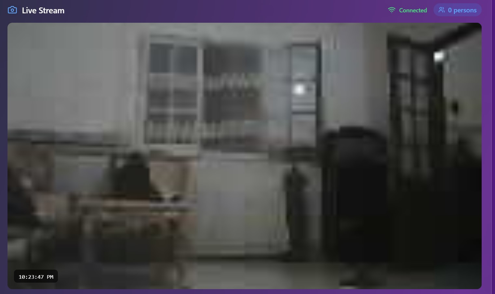
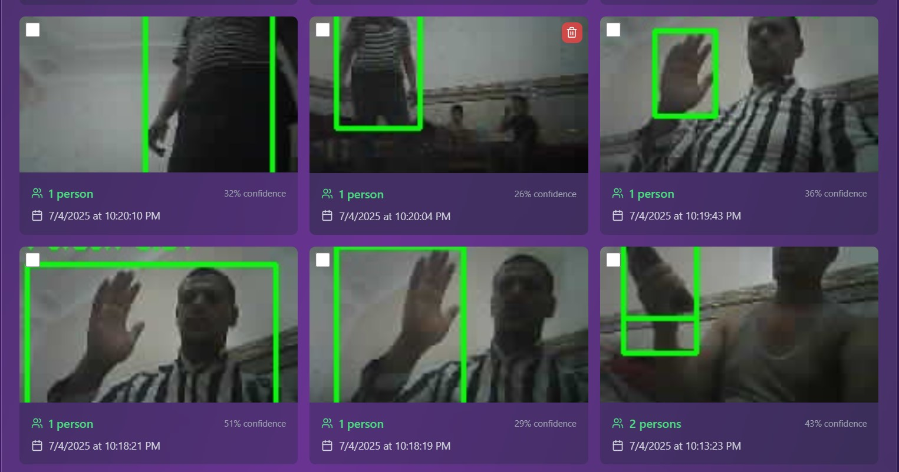

# ESP32-CAM Detection System - مبسط


# CESP32-CAM with real time stream and object detection


#Exemple for object detection



## 🚀 تشغيل سريع

### 1. تشغيل الباكند (Flask Server)

```bash
cd backend
pip install flask flask-socketio flask-cors pillow
python app.py
```

### 2. تشغيل الفرونت إند (React)

```bash
npm install
npm run dev
```

### 3. برمجة ESP32-CAM

1. افتح `esp32_cam/esp32_cam.ino` في Arduino IDE
2. غيّر إعدادات الشبكة:
   ```cpp
   const char* ssid = "اسم_شبكتك";
   const char* password = "كلمة_المرور";
   const char* server_host = "192.168.1.100"; // IP جهازك
   ```
3. ارفع الكود للـ ESP32-CAM

## 📁 هيكل المشروع

```
├── src/                    # React Frontend
├── backend/
│   ├── app.py             # Flask Server (مبسط)
│   └── requirements.txt   # مكتبات Python
└── esp32_cam/
    └── esp32_cam.ino      # كود ESP32-CAM (مبسط)
```