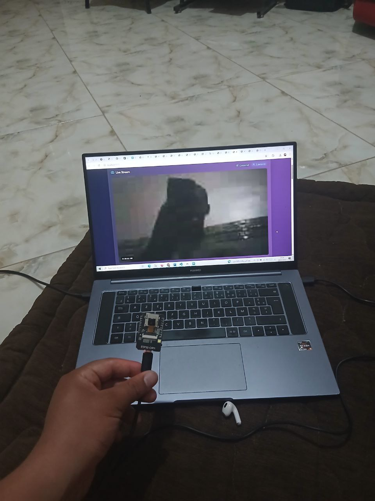

# Real-Time Object Detection and Monitoring System Using ESP32-CAM and YOLO :

An intelligent, real-time computer vision system built using ESP32-CAM, Flask, and React.
The ESP32-CAM module captures images continuously and sends them to a Flask-based back-end server that hosts a pre-trained YOLO (You Only Look Once) model for object detection.

Detected objects are marked with bounding boxes, and the processed images are streamed to a React-based front-end, allowing users to monitor live feeds with visual object recognition overlays.

This system enables:

Real-time smart surveillance

On-device image processing without relying on cloud services

An interactive web interface for viewing live object detection results


# ESP32-CAM Detection System 


# CESP32-CAM with real time stream and object detection



# Exemple for object detection


## 🚀 تشغيل سريع

### 1. تشغيل الباكند (Flask Server)

```bash
cd backend
pip install flask flask-socketio flask-cors pillow
python app.py
```

### 2. تشغيل الفرونت إند (React)

```bash
npm install
npm run dev
```

### 3. برمجة ESP32-CAM

1. افتح `esp32_cam/esp32_cam.ino` في Arduino IDE
2. غيّر إعدادات الشبكة:
   ```cpp
   const char* ssid = "اسم_شبكتك";
   const char* password = "كلمة_المرور";
   const char* server_host = "192.168.1.100"; // IP جهازك
   ```
3. ارفع الكود للـ ESP32-CAM

## 📁 هيكل المشروع

```
├── src/                    # React Frontend
├── backend/
│   ├── app.py             # Flask Server (مبسط)
│   └── requirements.txt   # مكتبات Python
└── esp32_cam/
    └── esp32_cam.ino      # كود ESP32-CAM (مبسط)
```